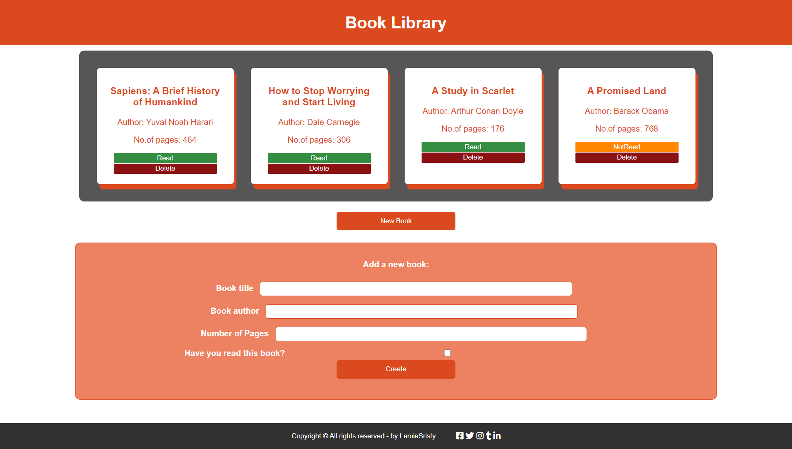

# PROJECT: LIBRARY

This project is a simple library where an user can add or remove books that have title, author, number of pages and read status. 
The follwing things have been practiced here:
- DOM Manipulation with JavaScript
- Use of JavaScript functions and loops

## Live Demo:
[My Library](https://raw.githack.com/talhawaqar/Library_JS/feature/index.html)

## Screen-shots:


## Build-With

- HTML5
- CSS3
- JavaScript
- VScode

## Getting Started

**To get this project set up on your local machine, follow these simple steps:**

1. Open Terminal.
2. Navigate to your desired location to download the contents of this repository.
3. Copy and paste the following code into the Terminal: git clone https://github.com/talhawaqar/Library_JS
4. Run ```cd Library_JS```.

## Author Details::

👤 **Lamia Sristy**

- Github: [@LamiaSristy](https://github.com/LamiaSristy)
- Linkedin: [@LamiaSristy](https://www.linkedin.com/in/lamia-hemayet-sristy/)
- E-mail: <a href="mailto:lamiasristy@gmail.com?subject=Hello Lamia!">Email</a>  
- Twitter: [@LamiaSristy](https://twitter.com/lsristy1)

👤 **Muhammad Talha Waqar**

- Github: [@talhawaqar](https://github.com/talhawaqar)
- E-mail:<a href="mailto:talhawaqar007@gmail.com?subject=Hello Talha!">Email</a>


## Show your support

Give ⭐ Star me on GitHub — it helps!

## 📝 License

This project is [MIT](lic.url) licensed.   
